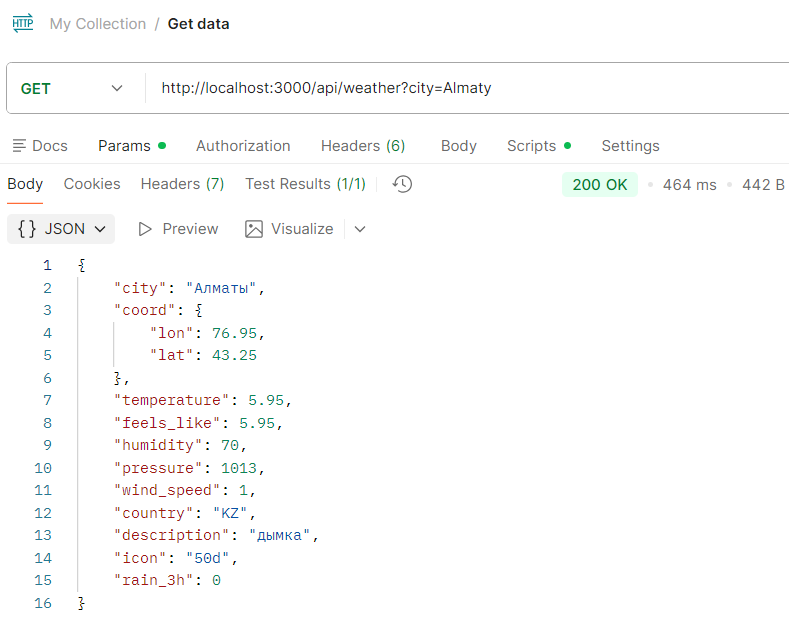
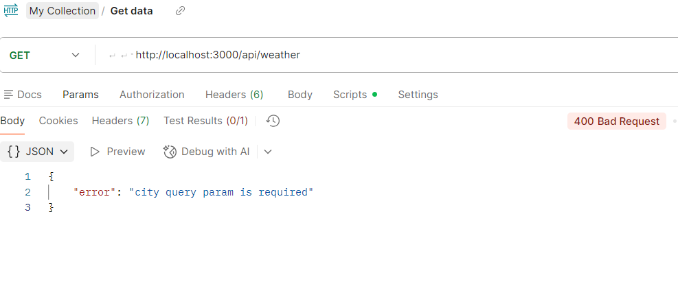
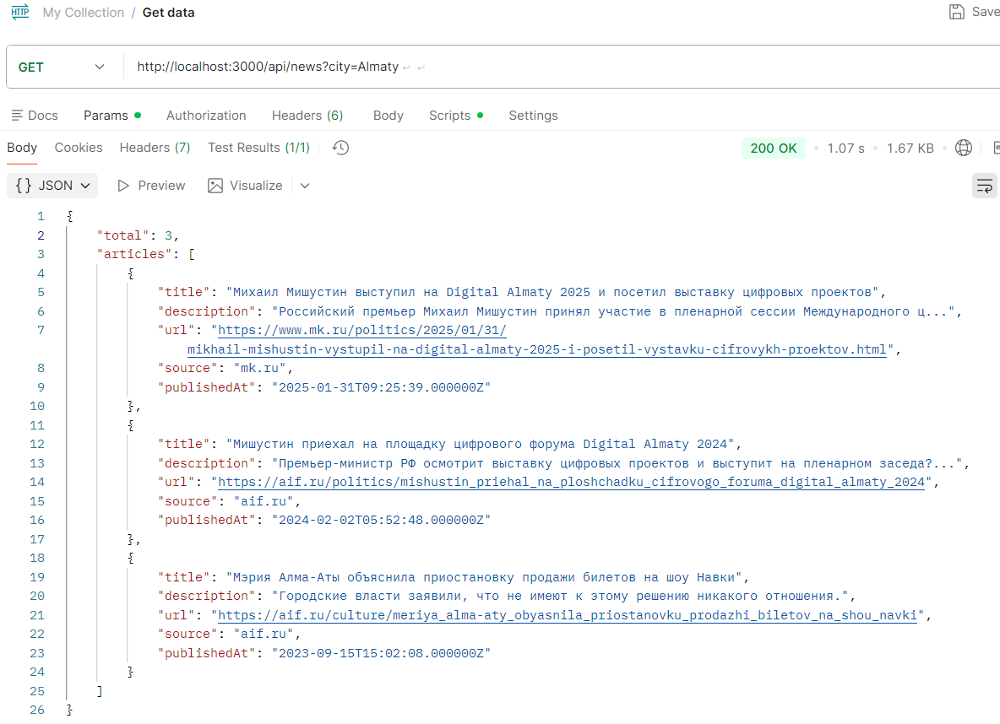
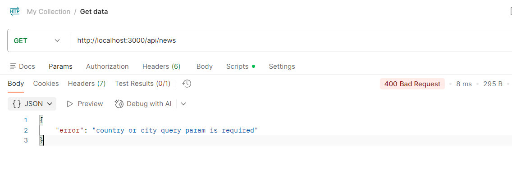
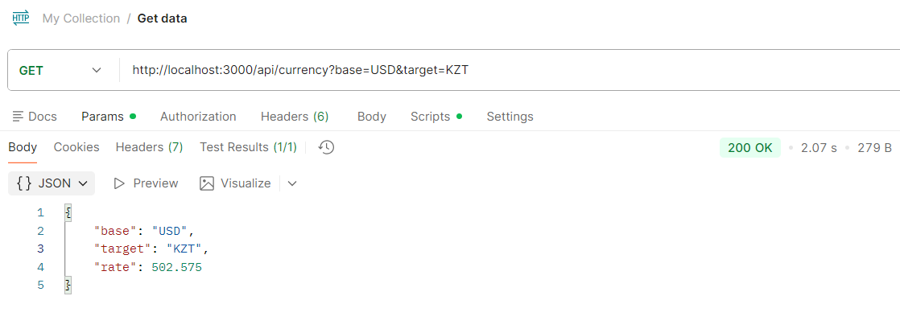
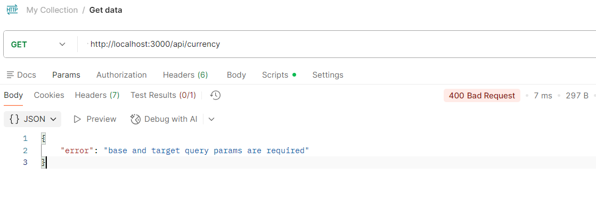

# Weather App

A simple web application that shows weather, news, and currency exchange rates for a searched city. Features an interactive map and dynamic data fetching.

## 🚀 How to Run

1.  **Install dependencies**:
    ```bash
    npm install
    ```

2.  **Configure Environment**:
    Create a `.env` file in the root directory and add your API keys:
    ```env
    OPENWEATHER_API_KEY=your_key
    NEWS_API_KEY=your_key
    CURRENCY_API_KEY=your_key
    ```

3.  **Start the Server**:
    ```bash
    npm start
    ```
    (or `node server.js`)

4.  **Open in Browser**:
    Go to [http://localhost:3000](http://localhost:3000)

## 🌍 APIs Used

*   **OpenWeather**: For current weather data.
*   **TheNewsAPI**: For top news headlines related to the city/country.
*   **CurrencyFreaks**: For latest exchange rates.

## 📡 API Endpoints

### 1. Weather
*   **Endpoint**: `/api/weather`
*   **Method**: `GET`
*   **Query Param**: `city` (e.g., `?city=Almaty`)
*   **Description**: Returns weather details including temperature, coordinates, humidity, and wind speed.

### 2. News
*   **Endpoint**: `/api/news`
*   **Method**: `GET`
*   **Query Params**: `city` or `country` (e.g., `?city=Almaty`)
*   **Description**: Returns top 5 news articles for the specified location.

### 3. Currency
*   **Endpoint**: `/api/currency`
*   **Method**: `GET`
*   **Query Params**: `base`, `target` (e.g., `?base=USD&target=KZT`)
*   **Description**: Returns the exchange rate between the base and target currency.

## 🖥️ Frontend Features

The frontend displays:
*   **Weather**: Main temperature, "feels like", humidity, pressure, wind speed, rain volume.
*   **Map**: Leaflet.js map centered on the city.
*   **News**: Latest headlines with links to full articles.
*   **Currency**: Current exchange rate for the country's currency.

## 📸 Postman Screenshots

### Weather
**200 OK** (Successful response)


**400 Bad Request** (Missing city parameter)


### News
**200 OK** (Successful response)


**400 Bad Request** (Missing parameters)


### Currency
**200 OK** (Successful response)


**400 Bad Request** (Missing base/target parameters)
